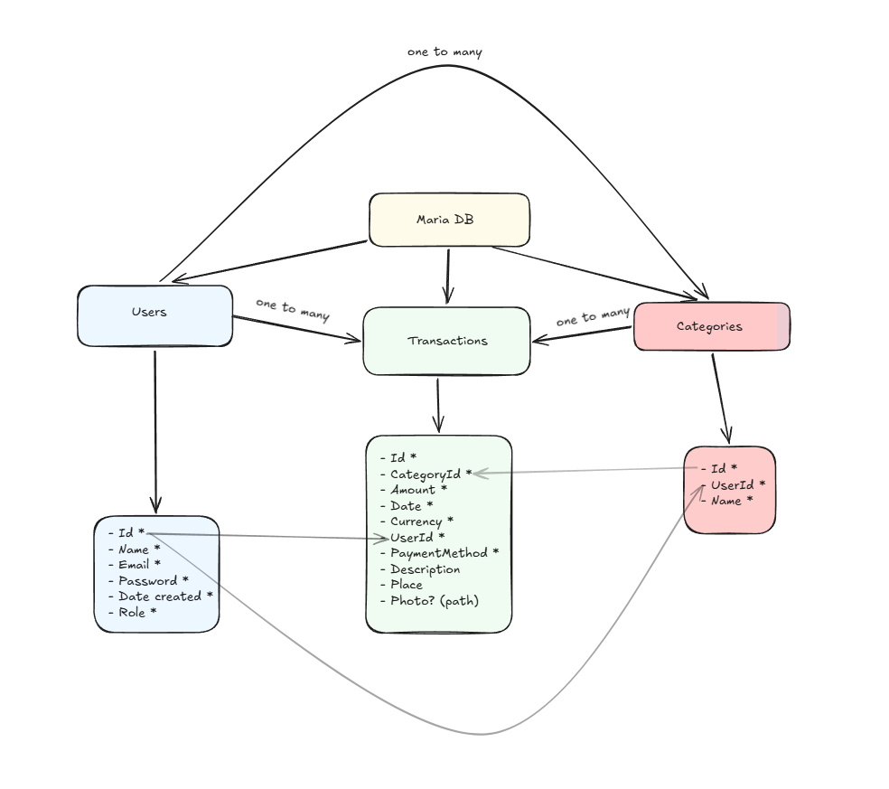
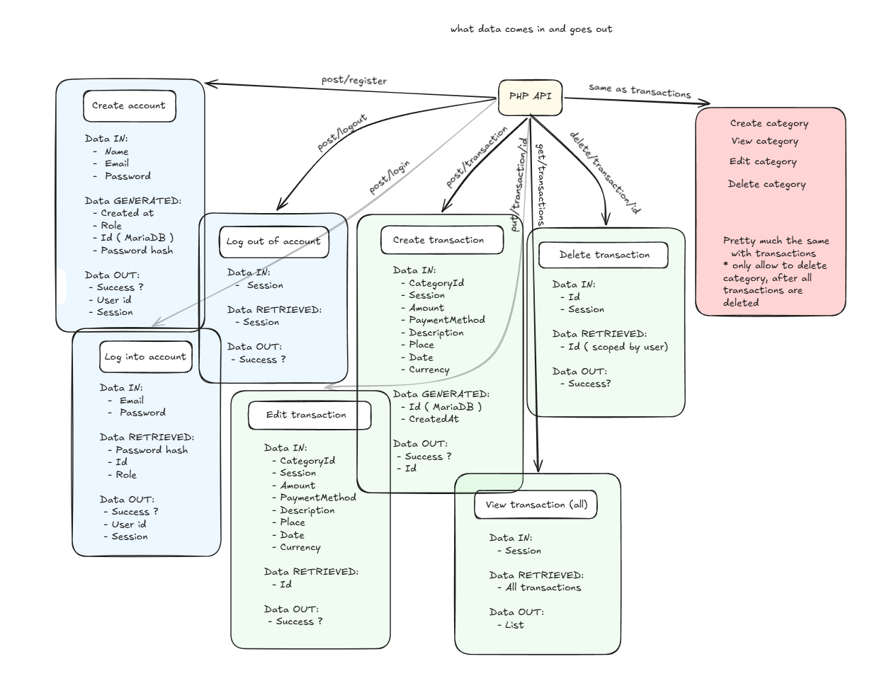

# Finance PHP

## Database relationships



## API request flow



## Setup

Requires PHP 8.4 with `pdo_mysql`, Composer, and MariaDB.

### Windows

Install [Composer](https://getcomposer.org/Composer-Setup.exe) and [MariaDB](https://mariadb.org/download/) with its Windows service enabled. Start the service from administrator PowerShell if needed:

```powershell
Start-Service MariaDB
```

Clone and install:

```powershell
git clone https://github.com/polihronos/finance-php.git
cd finance-php
composer install
Copy-Item .env.example .env
```

### macOS

With [Homebrew](https://brew.sh/) installed:

```bash
brew install composer mariadb
brew services start mariadb
```

Homebrew may also install its own PHP dependency.

Clone and install:

```bash
git clone https://github.com/polihronos/finance-php.git
cd finance-php
composer install
cp .env.example .env
```

## Run

Create a `finance_app` database. Set your local credentials in `.env`.

From the project root:

```sh
php -S localhost:8000 -t public
```

Open [localhost:8000](http://localhost:8000).

Table creation and API endpoints are not implemented yet.
